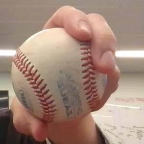
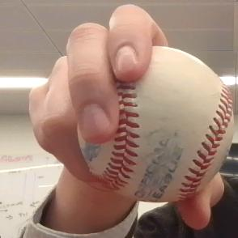
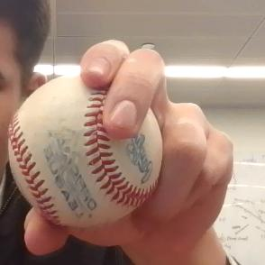
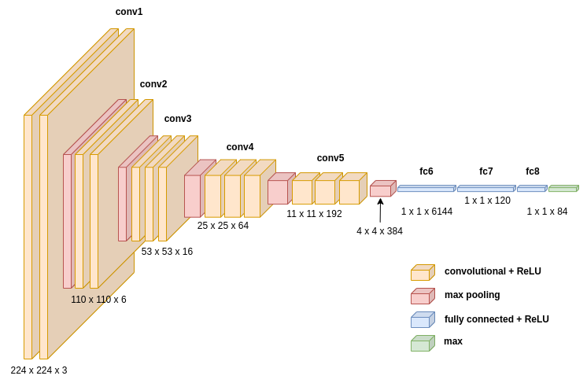

# Machine Learning for Classifying Baseball Grips

## Overview
A baseball pitcher places high importance on being able to deceive a hitter.
The interplay between pitcher and hitter is not unlike that of two chess 
opponents. As such, if a hitter can detect patterns in a pitcher's behavior
that tip off what pitch is being thrown, the chances of success (getting a hit)
are much higher.  

With this in mind, this project is the preliminary step in attempting to 
assess a pitcher's ability to disguise pitches. Using a convolutional 
neural network (CNN), baseball grips are classified with their corresponding
pitch in real-time: fastball, curveball, or changeup. Combined with pose 
estimation, this could serve as a foundation for future development on pitch 
prediction in real-time.

As the following sections describe, one challenge of this project was 
availability to data. Since there aren't any open source datasets for
baseball grip images or pitching videos from a batter's perspective, 
I built my own. This required a meticulous data augmentation process
to generate the synthetic dataset that my model is trained and tested 
on. The details of this process are explored in depth later on in this
README.

Thank you for your time and interest -- enjoy!

## Contents
This package contains the following files. In-depth descriptions for each 
can be found in subsequent sections.  

 - `main.py`: runs model training and prediction program with modifiable arguments
 - `train_model.py`: trains CNN on train & test images (examples provided)
 - `predict.py`: real-time classification using trained model
 - `image_augmentation.py`: generates large synthetic dataset from subset of example images  
 - `image_collection.py`: script used to collect images quickly
 - `sliding_window.py`: object detection using a sliding window technique

## Usage Instructions & Description

### main.py
This file can be used to both train a model on an image dataset and also load a trained model
to perform baseball grip classification in real-time using a webcam. When running `predict.py`
holding up a baseball to the camera within the bounding box shown will result in the grip being 
classified as indicated by blue text on the video frame. To run this file, use the command 
`python3 main.py` with some or all of the following arguments:  
 - `--train`: desired path to where trained model will be saved (default trained_model.pth)
 - `--epochs`: the number of epochs used in training the model (default 1000)
 - `--predict`: the path to model used for classification in real-time
Note: including the path for the `train` or `predict` arguments will run that step (i.e., If a
`train` path is provided, the model will be trained, otherwise it will not.).  

Examples of use:
```
python3 main.py --train "my_model.pth" --epochs 50 # trains model over 50 epochs and saves as 
my_model.pth

python3 main.py --predict "my_model.pth" # loads my_model.pth and runs real-time classification 
using webcam
```

### train_model.py
The primary function of this file is to train the convolutional neural network used in this 
classification problem. To run this file, use `main.py`.

Example of use:
```
python3 main.py --train "my_model.pth" --epochs 50 # trains model over 50 epochs and saves as 
my_model.pth
```

### predict.py
This file visualizes the effectiveness of the CNN generated by `train_model.py`. Running this 
file opens a window showing a live video feed of a webcam. Within this window is a green 
bounding box. Holding a baseball with a fastball, curveball, or changeup grip within that
box should result in the correct classification being shown in blue print on the video frame.
To run this file, use `main.py`.

Example of use:
```
python3 main.py --predict "my_model.pth" # loads my_model.pth and runs real-time classification 
using webcam
```
 
### image_augmentation.py
To run this file use the following command: 
    ```
    python3 image_augmentation.py   
    ```
This will generate 300 images of each grip (fastball, curveball, changeup). As a training set.
To generate the test set, change the `test_or_train` variable to `test`.  

The script performs the following augmentation techniques to a set of source images: 
 - Scaling
 - Transposition (Flipping Horizontally)
 - Rotation
 - Brightness Adjustment

Scaling                    |  Transposition            | Rotation                  | Brightness
:-------------------------:|:-------------------------:|:-------------------------:|:-------------------------:
 |   |  | 

### image_collection.py
To run this file use the following command: 
```
python3 image_augmentation.py   
```
This will start the image collection process using a webcam. Instructions and prompts can
be followed in the terminal window from which the user executed the above command. These 
instructions will guide a user through the process of taking 10 images of each grip (fastball, 
curveball, and changeup) and saving them. 

### sliding_window.py
This file performs a sliding window algorithm to detect a baseball within an image. The image
is divided up into sections that are classified using a trained model from `train_model.py`.
Each section is given a probability score and the image is cropped to the region with the 
highest score to isolate the baseball from the background. To run this file, use the 
following command:
```
python3 sliding_window.py --model [PATH TO MODEL] --image [PATH TO IMAGE] --[save] [True/False]
```

## Process

### Data Collection & Augmentation
Due the the lack of a baseball grip dataset, I wrote a couple scripts to generate a synthetic 
one of my own. The `image_collection.py` aids in collecting a large amount of grip images in 
a short amount of time. This script was distributed to peers in an effort to make the model 
more generalizable.  

Next came augmentation. To avoid overfitting and provide a wide variety of angles, lighting
conditions and other real-life variables more thoroughly than 100 images can, 
`image_augmentation.py` was written. This script takes images generated from `image_collection.py`
and augments them, ultimately generating a dataset of over 30,000 images from an original 
collection of 100 images per class (fastball, curveball, and changeup).  

This process allowed for the generation of a large baseball grip image dataset in a short 
period of time, thanks to image collection and augmentation techniques.

### Training the Model
This project is built around a convolutional neural network (CNN) trained on the augmented dataset
of baseball grip images described previously. The diagram below depicts the layers of the CNN. 


Note: Image generated by author using template from https://github.com/kennethleungty/Neural-Network-Architecture-Diagrams.

This model was able to produce 99% accuracy across all classes (fastball, curveball, changeup) on 
test data generated through the data augmentation techniques described above. When testing in 
real-life conditions, the results were around 87% accurate. 

### Prediction in Real-Time
After training the model, it was tested in real-time using a laptop webcam. The classifier was run
on video frames and predictions were averaged across a span of 10 frames. A bounding box was provided 
before adding in object detection (future feature). When gripping a baseball wihtin the bounding box, 
results proved to be ~87% accurate. 

Since the vast majority of the original source images were mine, the model is less accurate when 
testing on other users. Still, classification in a small sample size o (n = 3) of other users 
showed ~60% accuracy. This will be improved in the future by incorporating data from a wider
range of users.

Author Demo                    |  Other User          
:-------------------------:|:-------------------------:
 | 

### Object Detection
With the classifier identifying baseball grips at a high accuracy, the next problem to 
tackle was object detection. Until now, the baseball grip had to be placed in a 
defined bounding box so the classifier would only process that part of the image. 
Using object detection, a user would be able to place the ball wherever they want in
the video frame and the object detection algorithm would identify the ball and bound it, 
doing the work of the previuosly predefined bounding box. This feature has been built out 
on still images, but has yet to be incorporated into real time due to time and speed 
constraints. Moving forward, this will be implemented to improve flexibility. 


## Moving Forward
In the short term, there are two immediate areas for improvement:
 1. Improve generalizability of classification network
    - This will require further growth of the now existing baseball grip dataset.
    Gathering data from a wide variety of users with different skin tones, hand sizes,
    etc. will greatly improve the overall accuracy of the model for all users. 
 2. Implement object detection on real-time video data
    - Object detection works well on still images, but it has yet to be incorporated
    with the predict.py program. This can likely be done by running on a GPU rather 
    than CPU. Additionally, the object detection algorithm could be improved further 
    by taking a wider range of image sizes and comparing across all sizes. Improvements
    to accuracy must stay within speed constraints of real-time.

Long-term, this project can be incorporated into (as a feature, or simply inspiration)
real-time detection of a pitch through video recording of a pitcher on the mound. 
Pose estimation can be used to analyze a pitcher's mechanics and added as a feature into
the classification algorithm. Gaining a holisitic view of the pitcher from the 
perspective of a hitter will be critical to the usefulness of the model. Ultimately, 
the hope for this project is that it benefits pitchers by providing feedback on 
how effectively they are disguising pitches. 

Please direct any questions about this repository to marshalljohnson2022@u.northwestern.edu!
