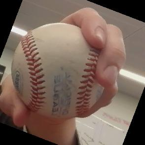

# Machine Learning for Classifying Baseball Grips

## Overview
A baseball pitcher places high importance on being able to deceive a hitter.
The interplay between pitcher and hitter is not unlike that of two chess 
opponents. As such, if a hitter can detect patterns in a pitcher's behavior
that tip off what pitch is being thrown, the chances of success (getting a hit)
are much higher.  

With this in mind, this project is the preliminary step in attempting to 
assess a pitcher's ability to disguise pitches. Using a convolutional 
neural network (CNN), baseball grips are classified with their corresponding
pitch in real-time: fastball, curveball, or changeup. Combined with pose 
estimation, this could serve as a foundation for future development on pitch 
prediction in real-time.

As the following sections describe, one challenge of this project was 
availability to data. Since there aren't any open source datasets for
baseball grip images or pitching videos from a batter's perspective, 
I built my own. This required a meticulous data augmentation process
to generate the synthetic dataset that my model is trained and tested 
on. The details of this process are explored in depth later on in this
README.

Thank you for your time and interest -- enjoy!

## Contents
This package contains the following files. In-depth descriptions for each 
can be found in subsequent sections.  

 - `image_augmentation.py`: generates large synthetic dataset from subset of example images  
 - `image_collection.py`: script used to collect images quickly
 - `main.py`: runs model training and prediction program with modifiable arguments
 - `predict.py`: real-time classification using trained model
 - `train_model.py`: trains CNN on train & test images (examples provided)

## Usage Instructions & Description

### main.py
This file can be used to both train a model on an image dataset and also load a trained model
to perform baseball grip classification in real-time using a webcam. When running `predict.py`
holding up a baseball to the camera within the bounding box shown will result in the grip being 
classified as indicated by blue text on the video frame. To run this file, use the command 
`python3 main.py` with some or all of the following arguments:  
 - `--train`: desired path to where trained model will be saved (default trained_model.pth)
 - `--epochs`: the number of epochs used in training the model (default 1000)
 - `--predict`: the path to model used for classification in real-time
 Note: including the path for the `train` or `predict` arguments will run that step (i.e., If a
 `train` path is provided, the model will be trained, otherwise it will not.).  

 Examples of use:
 ```
 python3 main.py --train "my_model.pth" --epochs 50 # trains model over 50 epochs and saves as 
 my_model.pth

 python3 main.py --predict "my_model.pth" # loads my_model.pth and runs real-time classification 
 using webcam
 ```
 
### image_augmentation.py
To run this file use the following command: 
    ```
    python3 image_augmentation.py   
    ```
This will generate 300 images of each grip (fastball, curveball, changeup). As a training set.
To generate the test set, change the `test_or_train` variable to `test`.  

The script performs the following augmentation techniques to a set of source images: 
 - Scaling
 - Transposition (Flipping Horizontally)
 - Rotation
 - Brightness Adjustment

Scaling                    |  Transposition            | Rotation                  | Brightness
:-------------------------:|:-------------------------:|:-------------------------:|:-------------------------:
 |   |  | 

### image_collection.py
To run this file use the following command: 
    ```
    python3 image_augmentation.py   
    ```
This will start the image collection process using a webcam. Instructions and prompts can
be followed in the terminal window from which the user executed the above command. These 
instructions will guide a user through the process of taking 10 images of each grip (fastball, 
curveball, and changeup) and saving them. 


## Process

### Data Collection & Augmentation
Due the the lack of a baseball grip dataset, I wrote a couple scripts to generate a synthetic 
one of my own. The `image_collection.py` aids in collecting a large amount of grip images in 
a short amount of time. This script was distributed to peers in an effort to make the model 
more generalizable.  

Next came augmentation. To avoid overfitting and provide a wide variety of angles, lighting
conditions and other real-life variables more thoroughly than 100 images can, 
`image_augmentation.py` was written. This script takes images generated from `image_collection.py`
and augments them, ultimately generating a dataset of over 30,000 images from an original 
collection of 100 images per class (fastball, curveball, and changeup).  

This process allowed for the generation of a large baseball grip image dataset in a short 
period of time, thanks to image collection and augmentation techniques.

### Training the Model

### Prediction in Real-Time

### Object Detection
